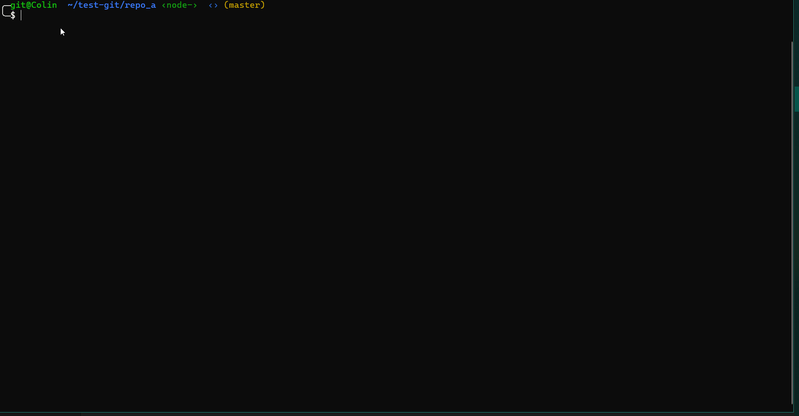
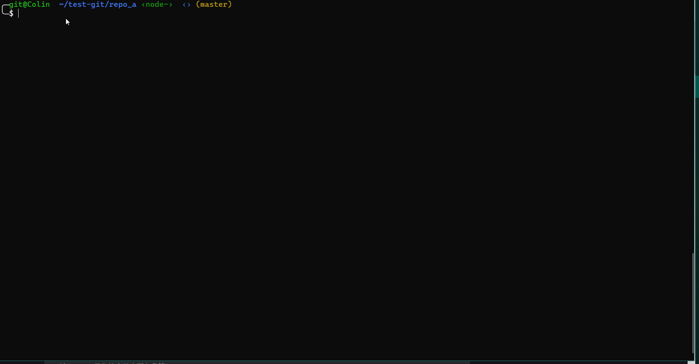

## 介绍

`git repo-clean`是用Golang开发的具备Git仓库大文件扫描，清理，并重写commit提交记录功能的Git拓展工具。

## 依赖环境：
+ Golang >= 1.15

+ Git >= 2.24.0

## 安装

+ 二进制包安装

下载链接：https://gitee.com/oschina/git-repo-clean/releases/

+ 源码编译安装

```bash
$ git clone https://gitee.com/oschina/git-repo-clean
# 进入源码目录，编译
$ cd git-repo-clean
$ make
```

+ 安装

对于Linux环境
> sudo cp git-repo-clean $(git --exec-path)

类似的，对于Windows环境，将可执行文件`git-repo-clean`的路径放到系统$PATH路径中，
或者复制该可执行文件到`C:\Windows\system32`目录下即可。

安装完成后，执行如下命令检测是否安装成功：
> git repo-clean --version

注：在`Mac OS`上进行配置之后可能无法执行，需要授权，具体方式为：
**System Preferences** -> **Security & Privacy**
点击 Allow Anyway 始终允许即可:


## 使用

有两种使用方式，一种是命令行，一种是交互式。

目前选项有如下：
```bash
  -v, --verbose		show process information
  -V, --version		show git-repo-clean version number
  -h, --help		show usage information
  -p, --path		Git repository path, default is '.'
  -s, --scan		scan the Git repository objects
  -b, --branch		set the branch to scan, default is current branch
  -l, --limit		set the file size limitation, like: '--limit=10m'
  -n, --number		set the number of results to show
  -t, --type		set the file type to filter from Git repository
  -i, --interactive 	enable interactive operation
  -d, --delete		execute file cleanup and history rewrite process
```

**命令行式用法:**



`git repo-clean --scan --limit=1G --type=tar.gz --number=1`
> 在仓库中使用命令行，扫描仓库当前分支的文件，文件最小为1G，类型为tar.gz，显示前1个结果

`git repo-clean --scan --limit=1G --type=tar.gz --number=1 --delete`
> 加上`--delete`选项，则会批量删除当前分支扫描出的文件，并重写相关提交历史

以上操作是假设在当前目录提交了大文件，然后需要在该分支进行删除。这个时候扫描的是当前分支的数据，而不是全部分支的数据，
这样做是为了加快扫描速度。如果想要清理其他分支的数据或者所有分支的数据，可以使用`--branch`选项，如`--branch=all`则
可以进行全扫描，会把所有分支上筛选出的数据清理掉。

`git repo-clean --scan --limit=1G --type=tar.gz --number=1 --delete --branch=all`
> 加上`--branch`选项，则会扫描所有分支的文件再执行删除，并重写相关提交历史

**交互式用法:**



`git repo-clean -i[--interactive]`
> 使用`-i` 选项进入交互式模式，此模式下，默认打开的开关有`--sacn`, `--delete`, `--verbose`

> 输入`git repo-clean`也可以直接进入交互模式


## 代码结构

+ main.go       | 程序主入口
+ options.go    | 程序选项参数处理
+ cmd.go        | 交互式命令处理
+ repository.go | 仓库扫描相关处理
+ fastexport.go | 启动git-fast-export进程
+ fastimport.go | 启动git-fast-import进程
+ parser.go     | 仓库数据解析
+ filter.go     | 仓库数据过滤
+ git.go        | Git对象相关
+ utils.go      | 一些有用帮助函数


## TODO
- [ ] 支持在同一个选项中有多个选择，如：--type=jpg, png, mp4
- [ ] 支持指定更准确范围的文件大小
- [ ] 对特殊文件名的处理
- [ ] 增加处理过程的进度提示信息，时间消耗信息等
- [ ] 对用户提供的仓库做进一步检测，如检测`.git`与工作目录是否分离
- [x] 提供选项给git-fast-export，对特定分支进行筛选，而不是所有分支
- [ ] 考虑重写历史对签名的影响
- [ ] 考虑重写历史对PR的影响
- [ ] 使用libgit2实现git操作

## BUG
+ 如果仓库中存在nested tag, 则在清理过程中会出现错误，如：`error: multiple updates for ref 'refs/tags/v1.0.1-pointer' not allowed`, 这会导致文件删除失败。暂时处理方式是一旦检测到这种情况，就退出程序，并显示警告信息。

## NOTE
+ 目前只关注文件本身，所以扫描时只关注blob类型对象
+ 从Git 2.32.0起，`git-rev-list`具备`--filter=object:type`选项，在扫描时能够过滤特定类型，这样能够加快处理过程，后续考虑使用较新的Git版本。
+ 考虑到有种情况是扫描出来的大文件(blob)只存在历史中，此时如果想删除，指定文件名是找不到该文件的。因此，实际在做文件删除时，应该指定为blob hash值，也就是虽然看起来用户选择的是文件名，实际上使用它对应的blob hash ID。

## 技术原理
见 [docs/technical.md](docs/technical.md)

## Contribute

1. Fork 本仓库
2. 新建 Feat_xxx 分支
3. 提交代码
4. 新建 Pull Request


## Licensing
git repo-clean is licensed under [Mulan PSL v2](LICENSE)


